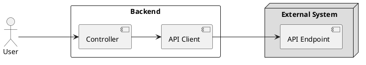

# ⚡ resiliency-with-arrowkt

## Background 

Consider you backend service makes calls to external service(s) and you would like to introduce [resliency](https://hackernoon.com/lets-talk-about-resilience-97051e14761f) to your API. 

The tools that you have in your toolkit are: 

- 🛠 **Kotlin** language to target the JVM 
- 🛠 **SpringBoot** as the web-framework
- 🛠 **RestTemplate** to make external API calls
- 🛠 **ArrowKT** to avoid exception-driven logical flows

## Target 




We will implement the [Circuit-Breaker](https://martinfowler.com/bliki/CircuitBreaker.html) pattern in this Target picture

## Error Handling Strategy 

1. The single API endpoint that is exposed by our service will respond with the follow non-200 OK HTTP status codes 


| | Condition  | Status Code | Retryable 
|-|------------- | ------------- |-------------|
|1.|External System responds with 5xx error  | Backend responds with 502  | Yes 
|2.|External System responds with 4xx error  | Backend responds with 502  | No
|3.|External System responds with 4xx error (**due to `User` input**)  | Backend responds with 400  | No

In this example project, we will not handle case 3.

## Background Details

### Error Handling using ArrowKT

1. The API Client class will not throw exceptions.
2. Operations will respond with an [Either](https://arrow-kt.io/docs/apidocs/arrow-core/arrow.core/-either/). 
3. Based on the response from the External System,the `Either` will contain a `ExternalAPIResponse` or `ExternalAPIError` object.
4. [Sealed classes](https://kotlinlang.org/docs/sealed-classes.html) are used to model both these types of objects
5. Results are then handled throught an exhaustive `when` [block](https://kotlinlang.org/docs/control-flow.html#when-expression). 

### Testing and Demonstration

1. Everything is driven through an end-to-end `SpringBootTest` which is named `ResiliencyApplicationTests`
2. The External System is mocked through [WireMock](http://wiremock.org/) 

## Solution 

In the end, we will need to have a Resilience4J based implementation of API Clients. 

```kotlin
class ResilientAPIClient(
	private val apiClient: Client,
	private val circuitBreaker: CircuitBreaker = newCircuitBreaker(name="backend"),
	private val retry: Retry = newRetry(name="backend")
): Client {

	override fun getCustomers() =
        circuitBreaker.executeEitherKT {
            retry.executeEitherKT {
                apiClient.getCustomers()
            }
        }
}
```

Do consider that most of the Reslience4J logic is hidden behind the two custom extension methods `circuitBreaker.executeEitherKT` and `retry.executeEitherKT`.

### Solution details 
An approach of an exception driven flow isolated to the extension method. 

Please see file listing here.

We could have 

1. Chosen to avoid to throw and catch Exception and instead create methods that look like the existing `executeSupplier` implementation in the library. 

This was avoided because then the code will have to be in lock-step with internal implementation of the library. Using exceptions, we still adhere to the public contract of how Resilience4J work: Exceptions when there are errors. 

I thought this was a better approach. 

What about the performance penalty? Depending on your use-case, this might not be a problem - as exceptions being used this way does not incur a very heavy performance penalty. Please see link in the References section below.

2. Chosen to inject the Reslience4J code directly into the RestTemplate code. 

This would couple both the libraries together. Also considering RestTemplate is only it's way out, we might as well keep it a bit separate. 

Also keeping the 'Reslient' API client in a separate class means that we can inject specific versions of the API Client into our services, using Feature-Flags. Also - when the time comes when we have to replace Resilience4J (remember, Hystrix?) then we just have to write another implementation of the APIClient. 

Other rejected solutions are available here.


