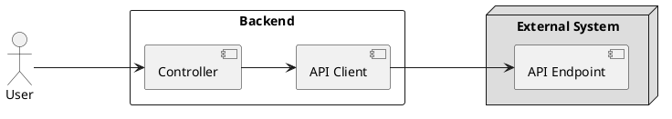

# ⚡ resiliency-with-arrowkt

## Background 

Consider that you choose the following tools in your backend service 
- 🛠 **Kotlin** language to target the JVM 
- 🛠 **SpringBoot** as the web-framework
- 🛠 **RestTemplate** to make external API calls
- 🛠 **ArrowKT** to avoid exception-driven logical flows

## Considerations

**RestTemplate** 
 - is a deprecated tool. _We must expect that it is replaced by future maintainers of the code-base._
 - makes use of exceptions for logic flow

**WireMock** 
 - will be used to test the API client

## Target 

