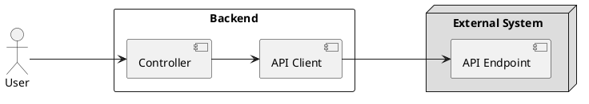

# ⚡ resiliency-with-arrowkt

## Background 

Consider that you choose the following tools in your backend service 
- 🛠 **Kotlin** language to target the JVM 
- 🛠 **SpringBoot** as the web-framework
- 🛠 **RestTemplate** to make external API calls
- 🛠 **ArrowKT** to avoid exception-driven logical flows

## Target 

## Error Handling Strategy 

1. The single API endpoint that is exposed by our service will respond with the follow non-200 OK HTTP status codes 

| | Condition  | Status Code | Retryable 
|-|------------- | ------------- |-------------|
|1.|External System responds with 5xx error  | Backend responds with 502  | Yes 
|2.|External System responds with 4xx error  | Backend responds with 502  | No
|3.|External System responds with 4xx error (**due to `User` input**)  | Backend responds with 400  | No

In this example project, we will not handle case 3.

## Background Details

### Error Handling using ArrowKT

1. The API Client class will not throw exceptions.
2. Operations will respond with an [Either](https://arrow-kt.io/docs/apidocs/arrow-core/arrow.core/-either/). 
3. Based on the response from the External System,the `Either` will contain a `ExternalAPIResponse` or `ExternalAPIError` object.
4. [Sealed classes](https://kotlinlang.org/docs/sealed-classes.html) are used to model both these types of objects
5. Results are then handled throught an exhaustive `when` [block](https://kotlinlang.org/docs/control-flow.html#when-expression). 

### Testing and Demonstration

1. Everything is driven through an end-to-end `SpringBootTest` which is named `ResiliencyApplicationTests`
2. The External System is mocked through [WireMock](http://wiremock.org/) 

## Solution Details 

For every solution, we must consider that Resilience4J primarily works with Exceptions. Since we don't use Exceptions in our own code (for example, in the APIClients, we will face a few small challenges. 

### Rejected Approaches 

**1. Using a RestTemplateInterceptor**

The advantage of using a RestTemplateInterceptor is that we can introduce resiliency to _all_ API calls made through a RestTemplate. This seems very powerful indeed. 

However, we will have throw an exception when the CircuitBreaker becomes open, and hence this approach was rejected since we were looking to avoid Exceptions in our logic flows.

**2. Decorating a `RestOperations` interface**

We could also decorate an RestOperations interface which can be passed to every APIClient, and hence we can still get the advantage of an application-wide change. 

However there are a lot of methods in the single RestOperations interface, and it would mean a lot of maintainence of boilerplate.

