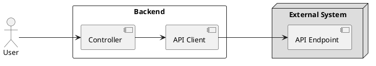

# ⚡ resiliency-with-arrowkt

## Background 

Consider you backend service makes calls to external service(s) and you would like to introduce [resliency](https://hackernoon.com/lets-talk-about-resilience-97051e14761f) to your API. 

The tools that you have in your toolkit are: 

- 🛠 **Kotlin** language to target the JVM 
- 🛠 **SpringBoot** as the web-framework
- 🛠 **RestTemplate** to make external API calls
- 🛠 **ArrowKT** to avoid exceptions

## Target 




We will implement the [Circuit-Breaker](https://martinfowler.com/bliki/CircuitBreaker.html) pattern in this Target picture

## Error Handling Strategy 

An errors arising during making a call to the External System are to be converted into ArrowKT [Either](https://arrow-kt.io/docs/apidocs/arrow-core/arrow.core/-either/) objects - which are then processed by the API controller. 

| | Condition  | Status Code | Retryable 
|-|------------- | ------------- |-------------|
|1.|External System responds with 5xx error  | Backend responds with 502  | Yes 
|2.|External System responds with 4xx error  | Backend responds with 502  | No
|3.|External System responds with 4xx error (**due to `User` input**)  | Backend responds with 400  | No

## Resiliency Strategy

We will implement two resiliency patterns: 

### Circuit-Breaker
If there is a progressive degradation of the External System, calls to the system will be blocked. 

If the Circuit-Breaker trips (due to say, the External System, being down) - the API Endpoint in our backend system would respond with a `503 Service Unavailable` 

### Retry
If there is an occassional failure during communication with the External System, the failed call will be retried automatically.

## Testing

1. All logic is driven through an end-to-end [test](https://github.com/vyvyd/resiliency-with-arrowkt/blob/main/src/test/kotlin/com/kotlin/resiliency/ResiliencyApplicationTests.kt)

2. All calls to the External System is mocked through [WireMock](http://wiremock.org/) in the end-to-end test. 

# Resiliency Solution 

A Resilience4J based implementation of API Client: 

```kotlin
class ResilientAPIClient(
	private val apiClient: Client,
	private val circuitBreaker: CircuitBreaker = newCircuitBreaker(name="backend"),
	private val retry: Retry = newRetry(name="backend")
): Client {

	override fun getCustomers() =
        circuitBreaker.executeEitherKT {
            retry.executeEitherKT {
                apiClient.getCustomers()
            }
        }
}
```

Do consider that most of the Reslience4J logic is hidden behind the two custom extension methods `circuitBreaker.executeEitherKT` and `retry.executeEitherKT`.

## Details 

The two extension functions can be seen [here](https://github.com/vyvyd/resiliency-with-arrowkt/blob/main/src/main/kotlin/com/kotlin/resiliency/external/resilience4j/Resilience4JExtensions.kt).

The implementation isolates the core Reslience4J code to the above two extension methods. The code evaluates the `Either` object that is returned by the `supplier`, and throws an `Exception` incase the result is an `Either.Left`. 

This thrown exception triggers the Resilience4J logic to kick in. Any known exceptions thrown by the library are again converted back into an `Either`.

**However, there are other ways to do this** 

### Alternate approaches

**Copy implemenration of other `executeSupplier` methods**  

We could copy over logic from the existing `executeSupplier` [implementation](https://github.com/resilience4j/resilience4j/blob/master/resilience4j-circuitbreaker/src/main/java/io/github/resilience4j/circuitbreaker/CircuitBreaker.java#L189) in the library, but this time for an ArrowKT `Either` object. 

We avoided because then the code will have to be in lock-step with internal implementation of the library. This is best avoided. 


